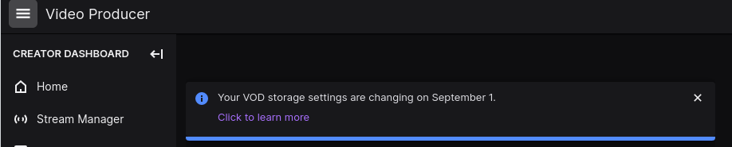

# Guia da Streamer Soberana
## Fabricio C Zuardi
### São Paulo, Agosto de 2022

<!--
Olá, meu nome é Fabricio. E eu estou aqui hoje para falarmos um pouco sobre streaming e autodeterminação. Mas antes de começar, eu queria assistir um trecho de um video, com voces, pode ser?
-->

---
class: text-center
---

# Battletoads Turbo Tunnel de olhos vendados

<center>
<iframe width="560" height="315" src="https://www.youtube.com/embed/z7xEfoJDGro?clip=UgkxQjkp6FTnYJBRbb25S14SRIiTnIEJGKSR&amp;clipt=EL3JCBidngw" title="YouTube video player" frameborder="0" allow="accelerometer; autoplay; clipboard-write; encrypted-media; gyroscope; picture-in-picture" allowfullscreen></iframe>
</center>

https://youtu.be/z7xEfoJDGro

<!--
Eu separei este clipe aqui. Esta é a terceira fase do jogo Battletoads do Nintendinho, uma das difíceis do jogo,  mesmo de olhos abertos e principalmente quando jogando em dupla, pois se um morre, ambos voltam para o ultimo checkpoint.
..
Ok, eu vou pedir para todo mundo fazer silencio e deixar os eletronicos de lado um pouco por favor. Entao por gentileza, feichem os laptops. Vamos lá? PLAY
..
Não é emocionante ver aconquista destas pessoas?
-->

---
layout: fact
---

# Voyeuristic consumption

> Voyeuristic consumption is a consumption
activity where one observes someone else performing the activity and experiences the same
enjoyment as to that which they would experience performing the activity themselves. Twitch is
a culturally prevalent example of this phenomenon.

<!--
Este momento que vivemos juntos aqui, foi um exemplo de uma pŕatica que acompanha a humanidade ha muito tempo, que é a experiencia de assistir outra pessoas executando acoes, nós compartilhamos o prazer pelas conquistas dosoutros,é o que nos faz assistir esportes na tv, programas de culinária e coisas do tipo. Sites de stream como o twitch.tv são plataformas voltadas a este tipo de consumo voyerístico.
-->

---
layout: four-images
image1: img/trovo-home.png
image2: img/trovo-session.png
image3: img/twitch-session.png
image4: img/twitch-home.png
---

# O fenômeno das lives

<!--
Jogadores, artistas, exibicionistas e pessoas vaidosas dos mais variados tipos transmitem diariamente,por horas nestas plataformas. Esta é uma modalidade de socializacao moderna, parecida com aatividade de se reunir na casa de alguém para jogar junto por exemplo.
-->

---
layout: four-images
image1: img/twitch-session.png
image2: img/trovo-session.png
image3: img/trovo-home.png
image4: img/twitch-home.png
---

# Twitch

<small>https://twitchtracker.com/statistics</small>


<!--
O número de pessoasque produzem e que consomem este tipo de conteúdo online só cresce, me parece ser um mercado queveio para ficar. Aqui alguns numeros.
-->

---
layout: two-cols
---

# Twitch é bacana

- plataforma de streaming
- democratizou transmissões ao vivo de *gamers*
- comprado pela Amazon em 2014 por US$270 milhões (all cash)
- concentra audiência
- gratuito

<!--
Estas plataformas sao de fatoum fenomeno, a Twitch.tv popularizou demais transmissoes aovivo de games, sejam elas caseiras ou profissionais. Ainda em2014 a Amazon notou  o potencial e comprou a empresa,pagando bem e em dinheiro. É um site gratuito e muito fácil de usar, e como é comum dessas empresas cuja estratégia éinvestir primeiro em crescimento, acabou virando uma referencia, o que concentra muita gente. Eu mesmo tenho uma conta na Twitch...
-->

---
layout: image
image: img/bucemi.jpg
class: text-center
---

# Eu na Twitch

<!--
Este sou eu na Twitch. O jovem de 40 anos no meio da molecada. Como curioso que sou, eu participo deste nicho, a minha maneira, sigo alguns developers brasileiros, alguns jogos que gosto, acompanho alguns jogadores profissionais (proplayers), algumas celebridades, e alguns amigos. Também transmito de vez em quando...
-->

---
layout: image
image: img/bucemi.jpg
---


https://twitter.com/fczuardi/status/153997099807

<!--
Numa dessas transmissões, mês passado, eu quis usar uma trilha sonora durante uma sessão de programação ao vivo (live-coding). E ao fim desta sessão, quando fui buscar a gravação,haviaum aviso de que se eu quisesseguardar o conteúdo da sessão, teria que sercomo audio em mudo por varios trechos. O algorítmo havia detectado automaticamente certas músicas que ainda não retornaram ao domínio público. Neste dia eu fui lembrado de que a casa lá nao era minha, eu estava debaixo de decisões tomadas por uma empresa, com os interesses comerciais de investidores, que nem sempreestarãoalinhados com os decada individuo que participa daquelelugar e que produz todo o conteúdo que faz deste um lugar valioso.
-->


---
layout: image
image: img/bucemi.jpg
---



<!--
Outro exemplo que vivenciei: dia primeiro de Setembro agora, o tempo que uma gravacao fica disponivel para download
diminuirá de 14 dias para 7 dias. -->
---


<!--
Os donos da plataforma, tem por estratégia querer incentivar os conteúdos
ao vivo, e isto torna tudo bem efemero. Quem participa deste site tem que estar de acordo com as regras
da empresa, e com os modelos de monetizacao escolhidos por eles, é um site que traz sua receita de publicidade,
venda de assinaturas e sabe-se la mais o que uma empresa faz com tamanha concentracao de videos e dados pessoais.

-->

---
layout: two-cols
---

# Twitch é bacana

- plataforma de streaming
- democratizou transmissões ao vivo de *gamers*
- comprado pela Amazon em 2014 por US$270 milhões (all cash)
- concentra audiência
- gratuito

::right::

# Twitch não é tão bacana

- plataforma centralizada
- restrições de copyright irrazoáveis & censura
- passa a ideia de [viabilidade vocacional](https://donotresearch.net/posts/the-dire-bullshit-economics-of-twitch-creators)
- você é o produto / dados sob custódia
- é um shopping, não uma praça
- [gamblification](https://www.npr.org/2022/08/16/1117650184/twitch-streamers-burnout-video-games?t=1660679429056), [burnout](https://www.npr.org/2022/08/16/1117650184/twitch-streamers-burnout-video-games?t=1660679429056)


<!--
Revisitando entao o slide sobre o que faz da Twitch um lugar muito bacana, depois de um tempo convivendo
la, algumas pessoas podem sentir uma necessidade de ter mais autonomia, de ter mais controle. O encanto
tecnologico inicial pode para alguns levar a uma certa ressaca e notar que existe também um lado não
tão bacana. Este lado nao tão bacana é semelhante aos problemas que outras grandes empresas que 
oferecem Software como Servico (SaaS) também chamado de Serviço como Substituto para Software (SaSS)
e que buscam uma grande concentracao de usuários em poucas plataformas centralizadas tem. Plataformas 
proprietárias "gratuitas" seguem aquela velha máxima de que quando vc nao paga pelo produto, o produto 
é voce, seu conteudo e seus dados, nestes serviços da Web 2.0 não são de fato seus, mas ao invés disso
estão sob CUSTÓDIA, construir sua comunidade sobre esta base pode dificultar a transferencia dela para 
outro lugar depois, a qualquer momento unilateralmente as regras do jogo podem mudar, os algoritmos
podem desmonetizar ou até mesmo censurar seu canal, suas doacoes nao sao totalmente suas, sempre
passam por um atravessador quee tira uma taxa, enfim, em algum ponto, pode ser que uma streamer queira
dar o próximo passo, pode ser que alguns sintam a necessidade de mais controle, mais liberdade e de mais 
soberania. Para estes, qual a saída?
-->
---
layout: cover
background: https://source.unsplash.com/collection/94734566/1920x1080
---

# Soberania, autoalojamento

<!--

A solução para quem busca mais controle, é o autoalojamento, self-hosting em Inglês. Que basicamente
significa: ter um servidor próprio. Um servidor éuma máquina que fica ligada 24
horas por dia. Um servidor normalmente roda o
sistema operacional Linux, que é um software livre, software livre é basicamente o tipo mais ético
de software que alguém pode escolher. Com um servidor próprio, voce pode, entre outras coisas: ter 
seu proprio endereco,
ditar as suas proprias regras, gravar seus videos e armazenar pelo tempo que quiser, receber doacoes
sem atravessadores e muito mais, pode inclusive continuar utilizando as plataformas proprietarias e 
centralizadas de terceiros se quiser, com um servidor proprio, voce pode retransmitir o seu conteudo
para quais outros lugares voce escolher também

-->
---

# Oficina

- Stream Próprio
  - <span><carbon-bare-metal-server-02 />:</span> [Owncast][owncast]
  - <span><carbon-laptop />:</span> [OBS Studio][obs]
- Restream para outras plataformas
  - <mdi-twitch /> Twitch, <mdi-youtube /> Youtube, etc
  - <span><carbon-bare-metal-server-02 />:</span> [Nginx + mod rtmp][modrtmp]
  - <span><carbon-laptop />:</span> OBS Studio
- Discussão

[owncast]: https://owncast.online/
[obs]: https://obsproject.com/
[modrtmp]: https://github.com/arut/nginx-rtmp-module


---

# Parte I: Servidor RTMP

- **<span><carbon-laptop />:</span> Máquina pessoal**
  - Instalação e configuração do OBS Studio
    - <mdi-cast /> rtmp: stream para o servidor
- **<span><carbon-bare-metal-server-02 />:</span> Linux conectado à Internet**
  - Instalação e configuração do Owncast
    - <span><mdi-web /></span> http: player, chat, interface admnistrativa
    - <span><mdi-broadcast /></span> [rtmp][rtmp]: recebimento do stream e transmissão pública
<!--  - Configuração de um endereço mais fácil
    - DuckDNS.org
  - <span><mdi-tor /></span> Configuração de um endereço mais privado
    - TOR Hidden Service
-->
[rtmp]: https://en.wikipedia.org/wiki/Real-Time_Messaging_Protocol

---

# OBS Studio

- <span><mdi-open-source-initiative /></span> [licença GPL v2](https://github.com/obsproject/obs-studio/blob/master/COPYING) 
- https://obsproject.com/

---

# Acessar o seu servidor

```bash
# servidor em rede local
ssh fcz@raspberrypi.local

# servidor online via IP (troque o número pelo seu IP público)
ssh ubuntu@101.226.101.21

# servidor online via domain name
ssh ubuntu@nome-do-servidor.duckdns.org
```

- Dica: [Duck DNS](https://www.duckdns.org/) (serviço gratuito de DDNS)

---

# Owncast

- <span><mdi-open-source-initiative /></span> [licença MIT](https://github.com/owncast/owncast/blob/develop/LICENSE)
- https://owncast.online/quickstart/

---

# Owncast, instalação rápida (e perigosa)
```bash
# script de instalação, caso confie neste shell script
curl -s https://owncast.online/install.sh | bash
```

---

# Owncast: Portas

- Website, chat(websocket) = TCP, 8080
- RTMP Server = TCP, 1935

---

# Owncast: Portas

- Se precisar redirecionar para outras portas
- Exemplo: 8080 -> 80 e 1935 -> 443 

```bash
sudo iptables -t nat -I PREROUTING -p tcp -m tcp --dport 443 -j REDIRECT --to-ports 1953
sudo iptables -t nat -I PREROUTING -p tcp -m tcp --dport 80 -j REDIRECT --to-ports 8080
```

---

# Parte II: Retransmissão


- Instalação do Nginx com módulo RTMP
- Cópia das chaves de acesso em plataformas de stream

---

# Instalação do Nginx com módulo RTMP
## em Debian, Ubuntu ou Raspberry Pi OS

```bash
# atualiza os repositórios
sudo apt update
# instala o servidor
sudo apt install libnginx-mod-rtmp
# edita a configuração principal
# troque vim pelo seu editor preferido (exemplo: nano)
sudo vim /etc/nginx/nginx.conf
```

---

## /etc/nginx/nginx.conf

```nginx
rtmp {
  server {
    # usando 443 como porta aqui só porque em muitos provedores ela 
    # já está liberada no firewall, normalmente o que se usa
    # é a porta 1935
    listen 443;
    application live {
      live on;
      record off;
      allow publish all;
      
      # Para onde publicar, rtmp://{endereço}:{porta}/{channel}/{stream_key};
      # (lembre-se de terminar com ponto e virgula ; )
      # Youtube
      # push rtmp://x.rtmp.youtube.com/live2/XXX12345;
      # Owncast
      # push rtmp://servidor-da-parte-1.duckdns.org:443/live/XXX12345;
      # Twitch
      # push rtmp://sao01.contribute.live-video.net/app/XXX12345;
      # Trovo
      # push rtmp://livepush.trovo.live/live/XXX12345;
    }
  } 
} 
```

---
layout: two-cols
---

# Twitch

- https://dashboard.twitch.tv
- Settings > Stream
- (anote) Primary Stream Key
- (anote) https://stream.twitch.tv/ingests/
  - ou copie do Settings do OBS

::right::


---
layout: two-cols
---

# Twitch

- https://dashboard.twitch.tv
- Settings > Stream
- (anote) Primary Stream Key
- (anote) https://stream.twitch.tv/ingests/
  - ou copie do Settings do OBS

::right::


---
layout: two-cols
---

# Youtube

- youtube.com
- botao "create" (camera com um sinal de +) > Go Live
- Right now > Streaming software > (sim / nao sobre se é para menores)
- (anote) Stream Settings > Stream key
- (anote) Stream Settings > Stream URL

::right::


---
layout: two-cols
---

# Youtube

- youtube.com
- botao "create" (camera com um sinal de +) > Go Live
- Right now > Streaming software > (sim / nao sobre se é para menores)
- (anote) Stream Settings > Stream key
- (anote) Stream Settings > Stream URL

::right::


---
layout: two-cols
---

# Youtube

- youtube.com
- botao "create" (camera com um sinal de +) > Go Live
- Right now > Streaming software > (sim / nao sobre se é para menores)
- (anote) Stream Settings > Stream key
- (anote) Stream Settings > Stream URL

::right::


---
layout: two-cols
---

# Youtube

- youtube.com
- botao "create" (camera com um sinal de +) > Go Live
- Right now > Streaming software > (sim / nao sobre se é para menores)
- (anote) Stream Settings > Stream key
- (anote) Stream Settings > Stream URL

::right::


---
layout: two-cols
---

# Youtube

- youtube.com
- botao "create" (camera com um sinal de +) > Go Live
- Right now > Streaming software > (sim / nao sobre se é para menores)
- (anote) Stream Settings > Stream key
- (anote) Stream Settings > Stream URL

::right::


---

# Restart do servidor

```bash
# reinicia o nginx, se não aparecer nenhuma mensagem é porque deu certo
sudo systemctl restart nginx
```

<v-click>

### exemplo de quando não dá certo
```
Job for nginx.service failed because the control process exited with error code.
See "systemctl status nginx.service" and "journalctl -xeu nginx.service" for details.
```

</v-click>


---

# Obrigado

- <span><mdi-web /></span> [blog.fabricio.org](https://blog.fabricio.org)
- <span><mdi-twitch /></span> [/sedentarismo](https://www.twitch.tv/sedentarismo)
- <span><mdi-twitter /></span> [@fczuardi](https://twitter.com/fczuardi)
- <span><mdi-github /></span> [/fczuardi](https://github.com/fczuardi)
- <span><mdi-linkedin /></span> [/in/fabricio](https://www.linkedin.com/in/fabricio/)
